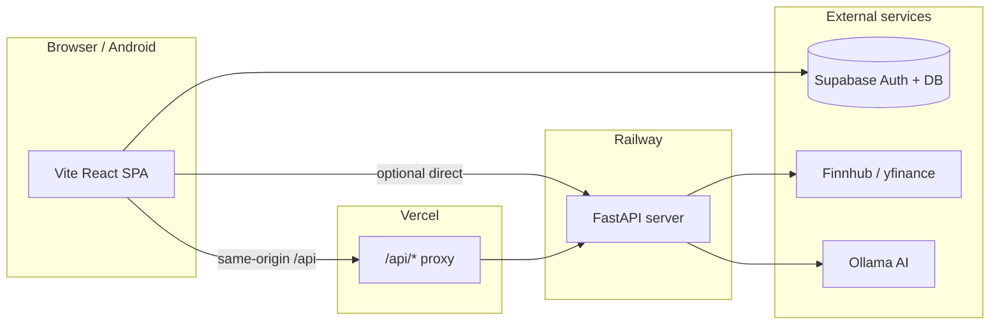

# Investio

Investio is a mobile-first fintech **education** app for learning how to invest. Users explore live market data, compare companies, build demo portfolios with performance tracking, and chat with an AI assistant — on web and Android (Capacitor).

**Design origin:** [Fintech Mobile App Prototype (Figma)](https://www.figma.com/design/1bz8GTMOZQExoTqyYuBSbw/Fintech-Mobile-App-Prototype)

| Environment | URL |
|-------------|-----|
| **Production (web)** | https://investio-wheat.vercel.app |
| **API (Railway)** | https://investio-production.up.railway.app |
| **Repository** | https://github.com/Investio007/Investio |

> **Disclaimer:** Investio is for education and simulation only. It does not hold funds, execute trades, or provide financial advice. All portfolio values are demo data.

---

## Features

### Home (`/home`)
- Demo portfolio value card with simulated daily change
- **Country market browser** — 10 markets (US, China, Japan, India, UK, France, Hong Kong, Canada, Germany, South Korea) with per-country stock lists
- Live price charts (1D / 1W / 1M / 6M / 1Y) via Finnhub with fallbacks
- **AI Market Insights** — top 20 live performers ranked by today's change, with AI score, rating, and prediction
- **Add to Portfolio** from insights with portfolio picker
- Quick links to Build Portfolio and Compare
- Add demo funds (`+` → `/add-funds`)

### Build Portfolio (`/portfolio-builder`)
- Create multiple named portfolios (demo amount, risk level, investment goal)
- Add companies from a searchable catalog (US mega-caps + global stocks)
- **Live portfolio performance** — per-holding price, day change %, demo P&L, summary card (gainers/losers, today's %)
- Tap a holding → stock analysis screen
- Delete portfolio confirmation dialog
- Data persists in `localStorage` and syncs to Supabase when signed in

### Compare (`/compare`)
- Side-by-side comparison of **8 companies:** Apple, Microsoft, Alphabet, NVIDIA, Amazon, Meta, Tesla, Netflix
- Live prices with auto-refresh (~60s)
- Long-term scores (growth, profit, stability, news mood)
- AI long-term pick with beginner tips

### AI Advisor (`/ai-assistant`, `/advisor`)
- Chat UI powered by **Ollama** (cloud or local)
- Plain-language answers with optional risk labels (Low / Moderate / High)
- Suggested starter questions

### Stock Analysis (`/analysis`, `/stock/:symbol`)
- Live quote + chart snapshot
- AI traffic-light analysis (growth, profitability, stability, competition)
- Add to portfolio with picker support

### Auth & onboarding
- Splash → onboarding → auth flow
- Email sign-up / sign-in with **password visibility toggle**
- **Forgot password** (`/auth/forgot-password`) and **reset password** (`/auth/reset-password`)
- Google OAuth (via Supabase) when configured
- **Sign-up legal consent** — Terms, Privacy, Cookies (`/legal/terms`, `/legal/privacy`, `/legal/cookies`)
- Responsive full-viewport auth layout with safe-area support
- Cloud sync of demo balance and portfolios when signed in
- Demo bypass exists for **local dev only** (`import.meta.env.DEV`) — not shown in production builds

### App shell
- Bottom navigation: Home, Portfolio, Compare, AI Advisor
- Global toast notifications
- Protected routes redirect to `/auth` when logged out

---

## Architecture



**How market data reaches production**

1. **Recommended:** Leave `VITE_MARKET_API_URL` unset on Vercel. The app calls same-origin `/api/*`; `vercel.json` proxies to Railway.
2. **Alternative:** Set `VITE_MARKET_API_URL` to your Railway URL **without a trailing slash** (e.g. `https://investio-production.up.railway.app`). The app normalizes trailing slashes, but omitting them avoids confusion.

---

## Tech stack

| Layer | Technology |
|--------|------------|
| Frontend | React 18, TypeScript, Vite 6, Tailwind CSS 4, React Router 7 |
| UI | Radix UI, Lucide icons, Recharts |
| Mobile | Capacitor (Android) |
| Backend | Python 3.12, FastAPI, Uvicorn |
| Market data | Finnhub (primary), yfinance, Alpha Vantage (fallbacks) |
| AI | Ollama (`gemma3:4b` on Ollama Cloud by default) |
| Auth & cloud | Supabase (profiles, portfolio sync, Google OAuth, password reset) |
| Hosting | Vercel (frontend), Railway (backend) |
| CI | GitHub Actions (frontend build/typecheck, backend smoke tests, secrets scan) |

---

## Project structure

```
├── src/app/
│   ├── screens/          # Route screens (Home, Compare, Portfolio, Auth, Legal, etc.)
│   ├── components/       # UI, MobileNav, AuthPageLayout, PasswordInput, SignUpLegalConsent
│   ├── context/          # InvestioContext (portfolios, balance, auth)
│   ├── hooks/            # useMarketData, usePortfolioQuotes, useAddToPortfolioWithPicker
│   ├── services/         # marketApi, aiApi, supabaseDb
│   ├── lib/              # authSessionFromUrl, marketApiBaseUrl, portfolioPerformance
│   ├── content/          # legalPolicies.ts
│   └── data/             # assets, countryMarkets, portfolioCatalog
├── server/
│   ├── main.py           # FastAPI market + AI API
│   ├── Procfile          # Railway start command
│   └── nixpacks.toml
├── scripts/
│   ├── qa-smoke.mjs      # Production smoke tests (22 checks)
│   └── sync-oauth-to-supabase.mjs
├── supabase/             # Schema / migrations
├── public/               # logo.png, icon.svg, favicons
├── .github/workflows/    # CI/CD pipelines
├── vercel.json           # SPA rewrite + /api proxy to Railway
├── railway.toml          # Railway deploy config
├── TESTING.md            # Manual QA checklist
└── .env.example          # Environment variable template
```

---

## Getting started (local)

### Prerequisites
- **Node.js** 20+ (CI uses 24)
- **Python** 3.12
- **npm**

### 1. Install dependencies

```bash
npm install
```

### 2. Python virtual environment (backend)

```bash
cd server
python -m venv venv

# Windows
venv\Scripts\activate
pip install -r requirements.txt

# macOS / Linux
source venv/bin/activate
pip install -r requirements.txt

cd ..
```

### 3. Environment variables

Copy `.env.example` to `.env` in the project root and fill in keys.

#### Frontend (`.env` — `VITE_*` are public in the browser bundle)

| Variable | Required | Purpose |
|----------|----------|---------|
| `VITE_SUPABASE_URL` | For auth/sync | Supabase project URL |
| `VITE_SUPABASE_ANON_KEY` | For auth/sync | Supabase anon (public) key |
| `VITE_MARKET_API_URL` | Local prod builds | `http://localhost:8002` — omit on Vercel (use proxy) |
| `VITE_AUTH_REDIRECT_URL` | Optional | Custom OAuth callback (Capacitor / custom domain) |
| `VITE_AUTH_RESET_REDIRECT_URL` | Optional | Custom password-reset redirect |

#### Backend (`.env` or Railway env — **never** use `VITE_*` for secrets)

| Variable | Required | Purpose |
|----------|----------|---------|
| `FINNHUB_API_KEY` | Recommended | Live quotes ([finnhub.io](https://finnhub.io/register)) |
| `OLLAMA_API_KEY` | For AI chat | Ollama Cloud ([ollama.com](https://ollama.com)) |
| `OLLAMA_MODEL` | Optional | Default: `gemma3:4b` |
| `ALPHA_VANTAGE_KEY` | Optional | Fundamentals / chart fallback |
| `ENVIRONMENT` | Production | Set to `production` on Railway |
| `CORS_ORIGINS` | Production | `https://investio-wheat.vercel.app` |
| `ADMIN_API_KEY` | Optional | Protects cache admin endpoints |
| `AI_RATE_LIMIT` | Optional | Requests/min per IP for `/api/ai/chat` (default 30) |

> Never put secret keys in `VITE_*` variables — those are exposed to the browser.

### 4. Run the app

**Frontend + backend together (recommended):**

```bash
npm run dev:all
```

| Service | URL |
|---------|-----|
| App | http://localhost:5173 |
| API | http://127.0.0.1:8002 |
| Health check | http://127.0.0.1:8002/api/health |

Vite proxies `/api/*` to port **8002** in development.

### 5. npm scripts

| Script | Description |
|--------|-------------|
| `npm run dev` | Frontend only |
| `npm run dev:server` | Backend only |
| `npm run dev:all` | Frontend + backend |
| `npm run typecheck` | TypeScript check |
| `npm run build` | Production frontend build |
| `npm run preview` | Preview production build |
| `npm run qa` | typecheck + build + production smoke tests |
| `npm run qa:smoke` | 22 automated checks against production |
| `npm run sync:oauth` | Sync OAuth + redirect URLs to Supabase |
| `npm run build:android` | Build + Capacitor sync for Android |

---

## Deployment

### Frontend — Vercel

1. Connect the GitHub repo to Vercel.
2. Set environment variables:
   - `VITE_SUPABASE_URL`
   - `VITE_SUPABASE_ANON_KEY`
   - `VITE_MARKET_API_URL` — **optional** (recommended: leave unset and use `vercel.json` proxy)
3. Deploy from `main`. `vercel.json` handles:
   - `/api/:path*` → Railway backend
   - `/*` → SPA `index.html`

### Backend — Railway

1. Create a service from the repo; set **Root Directory** to `server`.
2. Set environment variables: `FINNHUB_API_KEY`, `OLLAMA_API_KEY`, `OLLAMA_MODEL`, `ENVIRONMENT=production`, `CORS_ORIGINS=https://investio-wheat.vercel.app`.
3. Railway uses `railway.toml` / `Procfile`: `uvicorn main:app --host 0.0.0.0 --port $PORT`.
4. Verify: `https://<your-service>.up.railway.app/api/health` returns `"status":"ok"`.

Update `vercel.json` if your Railway URL changes.

### Supabase

**Redirect URLs** (Authentication → URL configuration):

| URL | Purpose |
|-----|---------|
| `http://localhost:5173/auth/callback` | Local OAuth |
| `http://localhost:5173/auth/reset-password` | Local password reset |
| `https://investio-wheat.vercel.app/auth/callback` | Production OAuth |
| `https://investio-wheat.vercel.app/auth/reset-password` | Production password reset |

**Automated sync:** Add secrets from [`.github/oauth-secrets.template`](.github/oauth-secrets.template), then run **Actions → Sync OAuth Providers to Supabase**. The sync script registers callback + reset-password URLs for both localhost and production.

**Google Cloud Console:** OAuth client redirect URI must be `https://<project-ref>.supabase.co/auth/v1/callback`.

**Google OAuth branding:** Set app name and logo in Google Cloud Console; Supabase custom domain optional for consent-screen branding.

---

## API endpoints (backend)

| Method | Path | Description |
|--------|------|-------------|
| `GET` | `/api/health` | Server status, data sources, AI config |
| `GET` | `/api/quote/{symbol}` | Live quote |
| `GET` | `/api/chart/{symbol}/{period}` | Chart data (`1D`–`1Y`) |
| `GET` | `/api/snapshot/{symbol}/{period}` | Quote + chart bundle |
| `GET` | `/api/insights` | Top 20 live performers + AI insights |
| `GET` | `/api/compare` | 8-company compare with long-term scores |
| `GET` | `/api/sentiment/{symbol}` | AI traffic-light analysis |
| `POST` | `/api/ai/chat` | AI assistant chat |
| `GET` | `/api/cache/status` | In-memory cache debug |
| `DELETE` | `/api/cache/clear` | Clear server cache (admin key if set) |

---

## Data & persistence

- **Local:** `localStorage` — portfolios and demo balance (works offline)
- **Cloud:** Supabase `profiles` + `portfolio_items` when signed in (RLS enabled)
- **Market cache:** In-memory server cache (quotes ~60s, charts ~5m, compare ~60s)

---

## QA & testing

### Automated (run before every release)

```bash
npm run qa
```

`scripts/qa-smoke.mjs` checks production routes, API health, quotes, insights, compare, charts, CORS, and that no server secrets appear in the build output.

### Manual checklist

See **[TESTING.md](TESTING.md)** for the full pre-release checklist (auth, responsive layout, portfolio, compare, AI advisor, production sign-off).

**v0.1 status:** Production QA complete — auth, password reset, live market data, portfolio performance, and AI insights verified on https://investio-wheat.vercel.app.

---

## CI/CD

| Workflow | Triggers | Checks |
|----------|----------|--------|
| `frontend-ci.yml` | `src/**`, config changes | `typecheck`, `build` |
| `backend-ci.yml` | All PRs, `server/**` | Import check, health + cache smoke test |
| `secrets-scan.yml` | Push / PR | Gitleaks |
| `sync-oauth-providers.yml` | Manual | Push OAuth + redirect config to Supabase |

Branch protection on `main` requires CI to pass before merge.

---

## Security notes

**In place**
- Supabase auth with PKCE; session handling in `authSessionFromUrl.ts`
- Row Level Security on `profiles` and `portfolio_items`
- API keys server-side only; Gitleaks in CI
- CORS restricted in production via `CORS_ORIGINS`
- AI endpoint IP rate limiting
- Demo auth bypass disabled in production builds

**Recommended hardening (not yet implemented)**
- API-wide rate limits on public market endpoints
- Minimum 8-character signup passwords
- Vercel security headers (CSP, etc.)
- Optional JWT on AI endpoint

---

## Android (Capacitor)

```bash
npm run build:android   # build + cap sync
npm run cap:open:android
```

Configure `VITE_AUTH_REDIRECT_URL` and add matching URLs in Supabase for deep-link callbacks.

---

## Troubleshooting

### Production shows `$ —`, "Chart unavailable", or failed AI rankings

1. Check https://investio-wheat.vercel.app/api/health — should return JSON with `"status":"ok"`.
2. If health works but the UI does not:
   - **Trailing slash:** `VITE_MARKET_API_URL` must not end with `/` (or use the latest code that strips it).
   - **Wrong URL:** Remove `VITE_MARKET_API_URL` on Vercel and rely on the `vercel.json` proxy.
3. Redeploy Vercel after any env change (`VITE_*` are baked in at build time).
4. Hard refresh the browser (Ctrl+Shift+R).

### Backend port conflicts (Windows)

```powershell
Get-NetTCPConnection -LocalPort 8002 -ErrorAction SilentlyContinue |
  ForEach-Object { Stop-Process -Id $_.OwningProcess -Force -ErrorAction SilentlyContinue }
npm run dev:all
```

### Finnhub 403 on charts

Free Finnhub tier may not include candle data. Charts fall back to synthetic / yfinance / Alpha Vantage.

### AI not responding

Verify `OLLAMA_API_KEY` and `OLLAMA_MODEL` on Railway. Check `/api/health` → `ai.configured` is `true`.

### Google OAuth stuck or wrong redirect

- Start sign-in from `/auth` in the **same browser tab**.
- Use **https://investio-wheat.vercel.app/auth** for production OAuth — not a Vercel preview URL unless you added that preview to Supabase redirects.
- Supabase **Site URL** should be `https://investio-wheat.vercel.app` (not `localhost`). Localhost stays in the redirect allow list only.
- If you see `flow_state_already_used` or land on `localhost:5173` after Google sign-in: run `npm run dev` only when testing locally; otherwise use the production URL and re-run **Sync OAuth Providers to Supabase**.
- Re-run **Sync OAuth Providers to Supabase** after changing auth URLs.

### Google shows “Continue to supabase.co”

Normal unless you configure a Supabase custom auth domain. Set app name and logo in **Google Cloud Console** → OAuth consent screen for “Investio” branding.

### Password reset email link fails

Add `https://investio-wheat.vercel.app/auth/reset-password` to Supabase redirect URLs.

---

## License

Private / educational prototype. See repository owner for usage terms.
