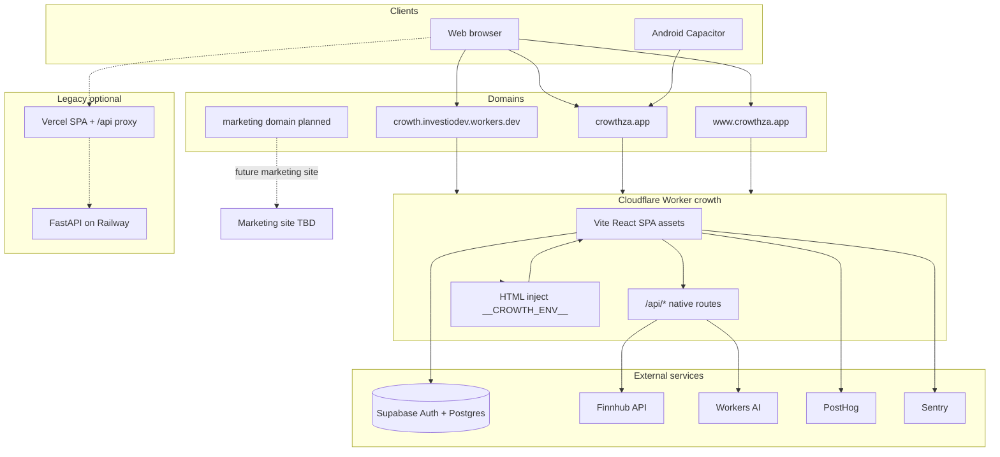

# Crowth

Crowth is a mobile-first fintech **education** app for learning how to invest. Users explore live market data, compare companies, build demo portfolios with performance tracking, and chat with an AI assistant — on web and Android (Capacitor).

**Design origin:** [Fintech Mobile App Prototype (Figma)](https://www.figma.com/design/1bz8GTMOZQExoTqyYuBSbw/Fintech-Mobile-App-Prototype)

| Environment | URL |
|-------------|-----|
| **Production (web)** | https://crowthza.app |
| **www** | https://www.crowthza.app |
| **workers.dev** | https://crowth.investiodev.workers.dev |
| **Planned marketing** | `crowthza.com` / `crowthsa.com` (if registered) |
| **Legacy web (Vercel)** | https://investio-wheat.vercel.app |
| **Legacy API (Railway)** | https://investio-production.up.railway.app |
| **Repository** | https://github.com/Investio007/Investio |

> **Disclaimer:** Crowth is for education and simulation only. It does not hold funds, execute trades, or provide financial advice. All portfolio values are demo data.

---

## Features

### Home (`/home`)
- Demo portfolio value card with simulated daily change
- **Country market browser** — 10 markets (US, China, Japan, India, UK, France, Hong Kong, Canada, Germany, South Korea) with per-country stock lists
- Live price charts (1D / 1W / 1M / 6M / 1Y) via Finnhub with fallbacks
- **AI Market Insights** — top 20 live performers ranked by today's change, with AI score, rating, and prediction
- **Add to Portfolio** from insights with portfolio picker
- Quick links to Build Portfolio and Compare
- Add demo funds (`+` → `/add-funds`)

### Build Portfolio (`/portfolio-builder`)
- Create multiple named portfolios (demo amount, risk level, investment goal)
- Add companies from a searchable catalog (US mega-caps + global stocks)
- **Live portfolio performance** — per-holding price, day change %, demo P&L, summary card (gainers/losers, today's %)
- Tap a holding → stock analysis screen
- Delete portfolio confirmation dialog
- Data persists in `localStorage` and syncs to Supabase when signed in

### Compare (`/compare`)
- Side-by-side comparison of **8 companies:** Apple, Microsoft, Alphabet, NVIDIA, Amazon, Meta, Tesla, Netflix
- Live prices with auto-refresh (~60s)
- Long-term scores (growth, profit, stability, news mood)
- AI long-term pick with beginner tips

### AI Advisor (`/ai-assistant`, `/advisor`)
- Chat UI powered by **Cloudflare Workers AI** in production (Llama 3.3)
- **Ollama** when running the local/Railway FastAPI backend
- Plain-language answers with optional risk labels (Low / Moderate / High)
- Suggested starter questions

### Stock Analysis (`/analysis`, `/stock/:symbol`)
- Live quote + chart snapshot
- AI traffic-light analysis (growth, profitability, stability, competition)
- Add to portfolio with picker support

### Auth & onboarding
- Splash → onboarding → auth flow
- Email sign-up / sign-in with **password visibility toggle**
- **Forgot password** (`/auth/forgot-password`) and **reset password** (`/auth/reset-password`)
- Google OAuth (via Supabase) when configured
- **Sign-up legal consent** — Terms, Privacy, Cookies (`/legal/terms`, `/legal/privacy`, `/legal/cookies`)
- Responsive full-viewport auth layout with safe-area support
- Cloud sync of demo balance and portfolios when signed in
- Demo bypass exists for **local dev only** (`import.meta.env.DEV`) — not shown in production builds

### App shell
- Bottom navigation: Home, Portfolio, Compare, AI Advisor
- Global toast notifications
- Protected routes redirect to `/auth` when logged out

---

## Architecture

Production runs on a **single Cloudflare Worker** (`crowth`) that serves the Vite SPA and native `/api/*` routes (Finnhub + Workers AI). Supabase handles auth and portfolio sync. Vercel + Railway remain as legacy fallbacks.


```mermaid
flowchart TB
  subgraph clients [Clients]
    Web[Web browser]
    Android[Android Capacitor]
  end

  subgraph domains [Domains]
    AppDomain["crowthza.app"]
    WwwDomain["www.crowthza.app"]
    WorkersDev["crowth.investiodev.workers.dev"]
    MktDomain["marketing domain planned"]
  end

  subgraph cloudflare [Cloudflare Worker crowth]
    SPA[Vite React SPA assets]
    API["/api/* native routes"]
    Inject["HTML inject __CROWTH_ENV__"]
  end

  subgraph external [External services]
    SB[(Supabase Auth + Postgres)]
    FH[Finnhub API]
    WAI[Workers AI]
    PH[PostHog]
    SE[Sentry]
  end

  subgraph legacy [Legacy optional]
    Vercel[Vercel SPA + /api proxy]
    Railway[FastAPI on Railway]
  end

  Web --> WorkersDev
  Web --> AppDomain
  Web --> WwwDomain
  Android --> AppDomain
  WorkersDev --> cloudflare
  AppDomain --> cloudflare
  WwwDomain --> cloudflare
  MktDomain -.->|future marketing site| MktPlaceholder[Marketing site TBD]

  cloudflare --> Inject
  Inject --> SPA
  SPA --> API
  SPA --> SB
  SPA --> PH
  SPA --> SE
  API --> FH
  API --> WAI

  Web -.-> Vercel
  Vercel -.-> Railway
```

**How market data reaches the app**

1. **Cloudflare (production):** Leave `VITE_MARKET_API_URL` unset. The app calls same-origin `/api/*` on `crowthza.app`, `*.workers.dev`, and related hosts (see `getMarketApiBaseUrl()`).
2. **Local dev:** Vite proxies `/api/*` to `localhost:8002` (FastAPI).
3. **Legacy Vercel:** Same-origin `/api/*` via `vercel.json` proxy to Railway.
4. **Android (Appflow):** Can override `VITE_MARKET_API_URL` to Railway or Cloudflare URL.

**Domain plan (Cloudflare Registrar)**

| Domain | Role |
|--------|------|
| `crowthza.app` | Product app → Worker `crowth` (live) |
| `www.crowthza.app` | Same Worker (live) |
| Marketing apex (e.g. `crowthza.com`) | Company site — separate project later |

See **[`docs/cloudflare.md`](docs/cloudflare.md)** for deploy steps, secrets, and custom domains.

---

## Tech stack

| Layer | Technology |
|--------|------------|
| Frontend | React 18, TypeScript, Vite 6, Tailwind CSS 4, React Router 7 |
| UI | Radix UI, Lucide icons, Recharts |
| Mobile | Capacitor (Android), Ionic Appflow |
| Production API | Cloudflare Worker (TypeScript) — Finnhub + Workers AI |
| Local / legacy API | Python 3.12, FastAPI, Uvicorn (Railway) |
| Market data | Finnhub (primary on Worker); yfinance / Alpha Vantage (FastAPI fallbacks) |
| AI | Workers AI (production Cloudflare); Ollama (local / Railway) |
| Auth & cloud | Supabase (profiles, portfolio sync, Google OAuth, password reset) |
| Hosting | **Cloudflare Workers + assets** (primary); Vercel + Railway (legacy) |
| Domains | Cloudflare Registrar — `crowthza.app` (app, live) |
| Observability | Sentry (errors), PostHog (analytics), UptimeRobot (uptime) |
| CI | GitHub Actions + Cloudflare Workers Builds (Git → `npm run build` → `wrangler deploy`) |

---

## Project structure

```
├── src/app/
│   ├── screens/          # Route screens (Home, Compare, Portfolio, Auth, Legal, etc.)
│   ├── components/       # UI, MobileNav, AuthPageLayout, PasswordInput, SignUpLegalConsent
│   ├── context/          # CrowthContext (portfolios, balance, auth)
│   ├── hooks/            # useMarketData, usePortfolioQuotes, useAddToPortfolioWithPicker
│   ├── services/         # marketApi, aiApi, supabaseDb
│   ├── lib/              # authSessionFromUrl, marketApiBaseUrl, portfolioPerformance
│   ├── content/          # legalPolicies.ts
│   └── data/             # assets, countryMarkets, portfolioCatalog
├── workers/
│   ├── api-proxy.ts      # Cloudflare Worker: SPA + /api routes
│   └── lib/              # Finnhub client, cache, sentiment, Workers AI
├── server/
│   ├── main.py           # FastAPI market + AI API (local dev / Railway legacy)
│   ├── sentry_init.py    # Sentry init (skips invalid DSN)
│   ├── Procfile          # Railway start command
│   ├── nixpacks.toml
│   └── railway.toml      # Railway deploy + healthcheck config
├── scripts/
│   ├── qa-smoke.mjs      # Production smoke tests (22 checks)
│   └── sync-oauth-to-supabase.mjs
├── supabase/             # Schema / migrations
├── public/               # logo.png, icon.svg, favicons, _headers
├── docs/
│   └── cloudflare.md     # Cloudflare deploy, secrets, domains
├── .github/workflows/    # CI/CD pipelines
├── wrangler.toml         # Cloudflare Worker config
├── vercel.json           # SPA rewrite + /api proxy to Railway (legacy)
├── railway.toml          # Notes only — deploy config lives in server/railway.toml
├── TESTING.md            # Manual QA checklist
└── .env.example          # Environment variable template
```

---

## Getting started (local)

### Prerequisites
- **Node.js** 20+ (CI uses 24)
- **Python** 3.12
- **npm**

### 1. Install dependencies

```bash
npm install
```

### 2. Python virtual environment (backend)

```bash
cd server
python -m venv venv

# Windows
venv\Scripts\activate
pip install -r requirements.txt

# macOS / Linux
source venv/bin/activate
pip install -r requirements.txt

cd ..
```

### 3. Environment variables

Copy `.env.example` to `.env` in the project root and fill in keys.

#### Frontend (`.env` — `VITE_*` are public in the browser bundle)

| Variable | Required | Purpose |
|----------|----------|---------|
| `VITE_SUPABASE_URL` | For auth/sync | Supabase project URL |
| `VITE_SUPABASE_ANON_KEY` | For auth/sync | Supabase anon (public) key |
| `VITE_MARKET_API_URL` | Local / Android override | `http://localhost:8002` — **omit on Cloudflare & Vercel** (same-origin `/api`) |
| `VITE_AUTH_REDIRECT_URL` | Optional | Custom OAuth callback (Capacitor / custom domain) |
| `VITE_AUTH_RESET_REDIRECT_URL` | Optional | Custom password-reset redirect |
| `VITE_SENTRY_DSN` | Production | Sentry React DSN for error monitoring |
| `VITE_SENTRY_ENVIRONMENT` | Optional | e.g. `production`, `preview` |
| `VITE_POSTHOG_KEY` | Optional | PostHog project API key (`phc_...`) |
| `VITE_POSTHOG_HOST` | Optional | Default `https://us.i.posthog.com` |

#### Cloudflare Worker secrets (production — **never** commit values)

Set via `npx wrangler secret put <NAME>` or Cloudflare dashboard → Worker `crowth` → Settings → Variables:

| Secret | Purpose |
|--------|---------|
| `FINNHUB_API_KEY` | Live market quotes & charts |
| `SUPABASE_URL` | Injected into SPA HTML as `window.__CROWTH_ENV__` |
| `SUPABASE_ANON_KEY` | Same — enables auth without Vite build vars |

Workers AI uses the `[ai]` binding in `wrangler.toml` (no API key needed).

#### Backend — local / Railway (`.env` in project root or Railway env)

| Variable | Required | Purpose |
|----------|----------|---------|
| `FINNHUB_API_KEY` | Recommended | Live quotes ([finnhub.io](https://finnhub.io/register)) |
| `OLLAMA_API_KEY` | For AI chat | Ollama Cloud ([ollama.com](https://ollama.com)) |
| `OLLAMA_MODEL` | Optional | Default: `gemma3:4b` |
| `ALPHA_VANTAGE_KEY` | Optional | Fundamentals / chart fallback |
| `ENVIRONMENT` | Production | Set to `production` on Railway |
| `CORS_ORIGINS` | Production | `https://investio-wheat.vercel.app` |
| `ADMIN_API_KEY` | Optional | Protects cache admin endpoints |
| `AI_RATE_LIMIT` | Optional | Requests/min per IP for `/api/ai/chat` (default 30) |
| `MARKET_RATE_LIMIT` | Optional | Requests/min per IP for market GET endpoints (default 120) |
| `ALPHA_VANTAGE_DAILY_LIMIT` | Optional | Max Alpha Vantage calls per day (default 25) |
| `SENTRY_DSN` | Production | FastAPI Sentry DSN — **must** start with `https://` (malformed values are skipped; see Troubleshooting) |
| `SENTRY_ENVIRONMENT` | Optional | e.g. `production` |

> Never put secret keys in `VITE_*` variables — those are exposed to the browser.

### 4. Run the app

**Frontend + backend together (recommended):**

```bash
npm run dev:all
```

| Service | URL |
|---------|-----|
| App | http://localhost:5173 |
| API | http://127.0.0.1:8002 |
| Health check | http://127.0.0.1:8002/api/health |

Vite proxies `/api/*` to port **8002** in development.

### 5. npm scripts

| Script | Description |
|--------|-------------|
| `npm run dev` | Frontend only |
| `npm run dev:server` | Backend only |
| `npm run dev:all` | Frontend + backend |
| `npm run typecheck` | TypeScript check |
| `npm run build` | Production frontend build |
| `npm run preview` | Preview production build |
| `npm run qa` | typecheck + build + production smoke tests |
| `npm run qa:smoke` | 22 automated checks against production |
| `npm run sync:oauth` | Sync OAuth + redirect URLs to Supabase |
| `npm run deploy:cloudflare` | Build + `wrangler deploy` to Worker `crowth` |
| `docker compose up api` | Run backend in Docker (port 8002) |
| `npm run build:android` | Build + Capacitor sync for Android |

---

## Deployment

### Production — Cloudflare Workers (recommended)

One Worker (`crowth`) serves the SPA and native `/api/*`. Deploys automatically from GitHub `main` via **Workers Builds**, or manually:

```bash
npm run deploy:cloudflare
```

**Required secrets** (see [`docs/cloudflare.md`](docs/cloudflare.md)):

```bash
npx wrangler secret put FINNHUB_API_KEY
npx wrangler secret put SUPABASE_URL
npx wrangler secret put SUPABASE_ANON_KEY
```

**Verify:**

```bash
curl https://crowthza.app/api/health
# → {"status":"ok","market_data":{"finnhub":true},"ai":{"provider":"workers-ai","configured":true}}
```

**Custom domains** are already in `wrangler.toml` (`crowthza.app`, `www.crowthza.app`). After registering a marketing domain, create a separate Cloudflare project for that site.

### Legacy — Vercel (web) + Railway (API)

1. Connect the GitHub repo to Vercel.
2. Set environment variables:
   - `VITE_SUPABASE_URL`
   - `VITE_SUPABASE_ANON_KEY`
   - `VITE_SENTRY_DSN` — optional, recommended for production error monitoring
   - `VITE_POSTHOG_KEY` — optional, recommended for product analytics
   - `VITE_MARKET_API_URL` — **optional** (recommended: leave unset and use `vercel.json` proxy)
3. Deploy from `main`. `vercel.json` handles:
   - `/api/:path*` → Railway backend
   - `/*` → SPA `index.html`

### Backend — Railway

1. Create a service from the repo; set **Root Directory** to `server`.
2. Set environment variables:
   - `FINNHUB_API_KEY`, `OLLAMA_API_KEY`, `OLLAMA_MODEL`
   - `ENVIRONMENT=production`
   - `CORS_ORIGINS=https://investio-wheat.vercel.app`
   - `SENTRY_DSN` — optional; full DSN starting with `https://` (see [Error monitoring](#error-monitoring-sentry))
3. Deploy config is in **`server/railway.toml`** (read when root dir is `server/`):
   - Start: `uvicorn main:app --host 0.0.0.0 --port $PORT`
   - Healthcheck path: `/api/health` (also `GET /` and `GET /health` return `{"status":"ok"}`)
4. Verify: `https://investio-production.up.railway.app/api/health` returns `"status":"ok"`.

Update `vercel.json` if your Railway URL changes.

### Uptime monitoring

[UptimeRobot](https://uptimerobot.com) (or similar) can watch:

| Monitor | URL |
|---------|-----|
| Cloudflare app | `https://crowthza.app/auth` |
| Cloudflare API | `https://crowthza.app/api/health` |
| workers.dev fallback | `https://crowth.investiodev.workers.dev/api/health` |
| Legacy web | `https://investio-wheat.vercel.app/auth` |
| Legacy API | `https://investio-production.up.railway.app/api/health` |

### Supabase

**Redirect URLs** (Authentication → URL configuration):

| URL | Purpose |
|-----|---------|
| `http://localhost:5173/auth/callback` | Local OAuth |
| `http://localhost:5173/auth/reset-password` | Local password reset |
| `https://crowthza.app/auth/callback` | Production OAuth |
| `https://crowthza.app/auth/reset-password` | Production password reset |
| `https://www.crowthza.app/auth/callback` | www OAuth |
| `https://www.crowthza.app/auth/reset-password` | www password reset |
| `https://crowth.investiodev.workers.dev/auth/callback` | workers.dev OAuth |
| `https://crowth.investiodev.workers.dev/auth/reset-password` | workers.dev reset |
| `https://investio-wheat.vercel.app/auth/callback` | Legacy Vercel OAuth |
| `https://investio-wheat.vercel.app/auth/reset-password` | Legacy Vercel reset |

**Automated sync:** Add secrets from [`.github/oauth-secrets.template`](.github/oauth-secrets.template), then run **Actions → Sync OAuth Providers to Supabase**. The sync script registers callback + reset-password URLs for both localhost and production.

**Google Cloud Console:** OAuth client redirect URI must be `https://<project-ref>.supabase.co/auth/v1/callback`.

**Google OAuth branding:** Set app name and logo in Google Cloud Console; Supabase custom domain optional for consent-screen branding.

---

## API endpoints

The same routes exist on **Cloudflare Worker** (production) and **FastAPI** (local dev / Railway legacy).

| Method | Path | Description |
|--------|------|-------------|
| `GET` | `/api/health` | Server status, Finnhub + AI config |
| `GET` | `/api/quote/{symbol}` | Live quote |
| `GET` | `/api/chart/{symbol}/{period}` | Chart data (`1D`–`1Y`) |
| `GET` | `/api/snapshot/{symbol}/{period}` | Quote + chart bundle |
| `GET` | `/api/insights` | Top 20 live performers + AI insights |
| `GET` | `/api/compare` | 8-company compare with long-term scores |
| `GET` | `/api/sentiment/{symbol}` | AI traffic-light analysis |
| `POST` | `/api/ai/chat` | AI assistant chat |

**FastAPI only** (Railway / local):

| Method | Path | Description |
|--------|------|-------------|
| `GET` | `/` , `/health` | Liveness (`{"status":"ok"}`) |
| `GET` | `/api/cache/status` | In-memory cache debug |
| `DELETE` | `/api/cache/clear` | Clear server cache (admin key if set) |
| `GET` | `/api/sentry-debug` | Trigger test error (dev only) |

---

## Data & persistence

- **Local:** `localStorage` — portfolios and demo balance (works offline)
- **Cloud:** Supabase `profiles` + `portfolio_items` when signed in (RLS enabled)
- **Market cache:** In-memory Worker cache (quotes ~60s, charts ~5m) on Cloudflare; FastAPI cache on Railway/local

---

## QA & testing

### Automated (run before every release)

```bash
npm run qa
```

`scripts/qa-smoke.mjs` checks production routes, API health, quotes, insights, compare, charts, CORS, and that no server secrets appear in the build output.

### Manual checklist

See **[TESTING.md](TESTING.md)** for the full pre-release checklist (auth, responsive layout, portfolio, compare, AI advisor, production sign-off).

**v0.1 status:** Cloudflare production live at https://crowthza.app (API, Workers AI, Supabase auth). Legacy Vercel + Railway still available.

See **[docs/crowth-live-status.html](docs/crowth-live-status.html)** for a visual stack completion dashboard (open in browser).

---

## Product analytics (PostHog)

Crowth uses **PostHog** for pageviews and product analytics (SPA route tracking + identified users when signed in).

### Setup

1. Create a project at [PostHog](https://posthog.com) (US cloud: `us.posthog.com`).
2. Copy **Project API key** (`phc_...`) from Project Settings.
3. Add to **Cloudflare / Vercel** (and local `.env`):
   - `VITE_POSTHOG_KEY` — your `phc_...` key
   - `VITE_POSTHOG_HOST` — `https://us.i.posthog.com` (optional if using US cloud)
4. Redeploy after env changes (`VITE_*` are baked in at build time; Cloudflare also injects Supabase via Worker secrets).

Initializes in `src/lib/posthog.ts` only when `VITE_POSTHOG_KEY` is set. Captures `$pageview` on React Router navigation and identifies users by Supabase id after sign-in.

### Verify

Open the app, navigate a few screens, then check PostHog → **Activity** or onboarding **Verify installation** — events should appear within ~1 minute.

---

## Error monitoring (Sentry)

Crowth uses Sentry on **frontend** (`@sentry/react`) and **backend** (`sentry-sdk` + FastAPI).

### Frontend (Cloudflare / Vercel)

1. Create a **React** project in [Sentry](https://sentry.io).
2. Add environment variables:
   - `VITE_SENTRY_DSN` — React DSN
   - `VITE_SENTRY_ENVIRONMENT` — `production` (optional)
3. Redeploy after adding env vars.

Initializes in `src/lib/sentry.ts` only when `VITE_SENTRY_DSN` is set.

**Local verify:** `Sentry.captureException(new Error("test"))` in the browser console (dev exposes `window.Sentry`).

### Backend (Railway)

1. Create a **FastAPI** project in Sentry.
2. Add to **Railway** → Variables:
   - `SENTRY_DSN` — full FastAPI DSN starting with `https://` (e.g. `https://abc@o123.ingest.us.sentry.io/456`)
   - `SENTRY_ENVIRONMENT` — `production` (optional; falls back to `ENVIRONMENT`)
3. Redeploy the Railway service.

Initializes in `server/sentry_init.py` before the FastAPI app starts. Invalid or malformed DSNs are logged and skipped so the API still starts (deploy healthchecks won't fail).

**Local verify** (dev only):

```bash
curl http://127.0.0.1:8002/api/sentry-debug
```

Then check **Sentry → Issues** for the backend project. This route returns 404 in production.

---

## CI/CD

| Workflow | Triggers | Checks |
|----------|----------|--------|
| `frontend-ci.yml` | `src/**`, config changes | `typecheck`, `build` |
| `backend-ci.yml` | All PRs, `server/**` | Import check, health + cache smoke test |
| `secrets-scan.yml` | Push / PR | Gitleaks |
| `sync-oauth-providers.yml` | Manual | Push OAuth + redirect config to Supabase |
| `uptime-check.yml` | Every 5 min | Cloudflare + legacy Vercel/Railway health |
| `supabase-backup.yml` | Weekly (Sunday) | `pg_dump` → GitHub artifact (needs `SUPABASE_DB_URL`) |

Branch protection on `main` requires CI to pass before merge.

---

## Security notes

**In place**
- Supabase auth with PKCE; session handling in `authSessionFromUrl.ts`
- Row Level Security on `profiles` and `portfolio_items`
- API keys server-side only; Gitleaks in CI
- CORS restricted in production via `CORS_ORIGINS`
- AI + public market endpoint IP rate limiting
- Minimum 8-character passwords on sign-up and reset
- Vercel security headers (CSP, HSTS) in `vercel.json`; Cloudflare Worker security headers on all responses
- Demo auth bypass disabled in production builds
- Sentry error boundary + `VITE_SENTRY_DSN` / `SENTRY_DSN` monitoring
- PostHog analytics with custom product events

---

## Android (Capacitor + Ionic Appflow)

The `android/` native project is committed for **Ionic Appflow** / CI (`npx cap sync android`).

```bash
npm run build:android   # build web + cap sync
npm run cap:open:android
```

**Appflow:** Connect repo `Investio007/Investio`, branch `main`. App ID `53b04909`. Package `com.crowth.app`.

Sync Production env from local `.env`:

```bash
npm run sync:appflow-env
```

Native Google Sign-In requires an Android OAuth client in Google Cloud with package `com.crowth.app` + signing SHA-1.

---

## Troubleshooting

### Cloudflare: "Supabase is not connected yet" on /auth

1. Set Worker secrets: `SUPABASE_URL` and `SUPABASE_ANON_KEY` (`npx wrangler secret put …`).
2. Redeploy: `npm run deploy:cloudflare`.
3. Hard refresh (Ctrl+Shift+R). View page source — should contain `window.__CROWTH_ENV__`.

### Cloudflare: market data or AI fails

1. Check `curl https://crowthza.app/api/health` → `finnhub: true`, `ai.configured: true`.
2. Set `FINNHUB_API_KEY` secret if missing.
3. AI uses Workers AI (Llama 3.3) — no separate API key; `[ai]` binding must exist in `wrangler.toml`.

### Railway deploy fails at "Healthcheck failure"

1. Open **Railway → Crowth → Deployments** and click **Diagnose** on the failed step.
2. Common causes:
   - **Invalid `SENTRY_DSN`** — must be a full URL starting with `https://`, or remove the variable. A malformed DSN crashes startup before uvicorn listens.
   - **Wrong healthcheck path** — set **Healthcheck Path** to `/api/health` in service Settings, or rely on `server/railway.toml`.
   - **Root directory** — must be `server` (not repo root).
3. Confirm the active deploy: `curl https://investio-production.up.railway.app/api/health` → `"status":"ok"`.

### Production shows `$ —`, "Chart unavailable", or failed AI rankings

1. **Cloudflare:** Check https://crowthza.app/api/health
2. **Legacy Vercel:** Check https://investio-wheat.vercel.app/api/health
3. If health works but the UI does not:
   - **Trailing slash:** `VITE_MARKET_API_URL` must not end with `/`
   - **Wrong URL:** Leave `VITE_MARKET_API_URL` unset on Cloudflare/Vercel (same-origin `/api`)
4. Hard refresh the browser (Ctrl+Shift+R).

### Backend port conflicts (Windows)

```powershell
Get-NetTCPConnection -LocalPort 8002 -ErrorAction SilentlyContinue |
  ForEach-Object { Stop-Process -Id $_.OwningProcess -Force -ErrorAction SilentlyContinue }
npm run dev:all
```

### Finnhub 403 on charts

Free Finnhub tier may not include candle data. Charts fall back to synthetic / yfinance / Alpha Vantage.

### AI not responding

- **Cloudflare:** Check `/api/health` → `ai.configured: true`. Test `POST /api/ai/chat` with `{"message":"hi"}`.
- **Railway / local:** Verify `OLLAMA_API_KEY` and `OLLAMA_MODEL`. Check `/api/health` → `ai.configured` is `true`.

### Google OAuth stuck or wrong redirect

- Start sign-in from `/auth` in the **same browser tab**.
- Use **https://crowthza.app/auth** for production OAuth.
- Supabase redirect URLs must include your production callback + reset-password URLs.
- Re-run **Actions → Sync OAuth Providers to Supabase** after adding domains.

### Google shows “Continue to supabase.co”

Normal unless you configure a Supabase custom auth domain. Set app name and logo in **Google Cloud Console** → OAuth consent screen for “Crowth” branding.

### Password reset email link fails

Add your production reset URL to Supabase redirect URLs (e.g. `https://crowthza.app/auth/reset-password`).

---

## License

Private / educational prototype. See repository owner for usage terms.
